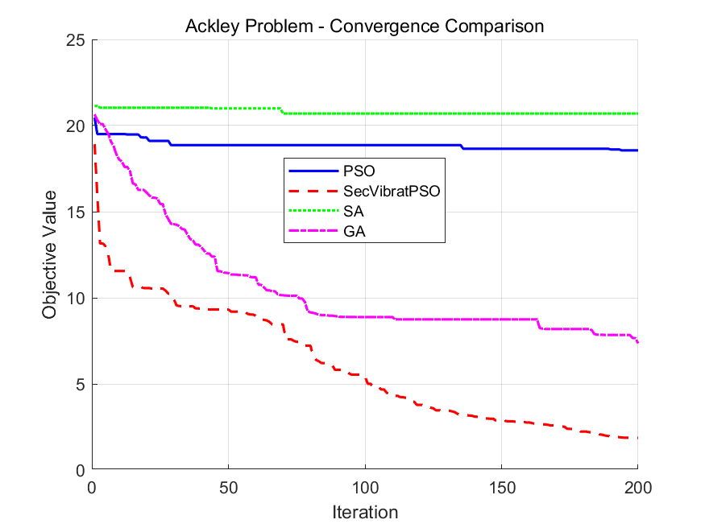
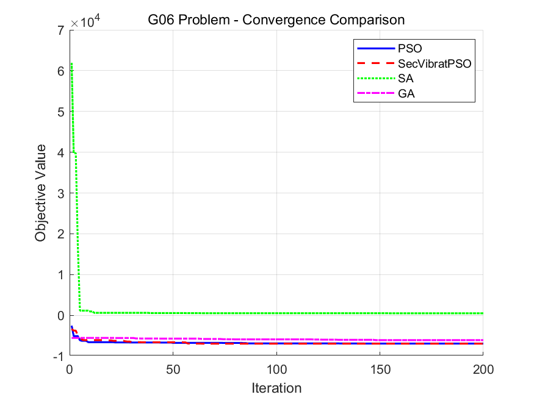
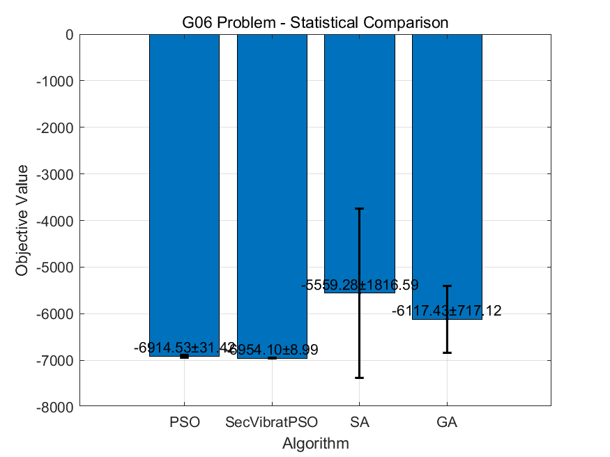
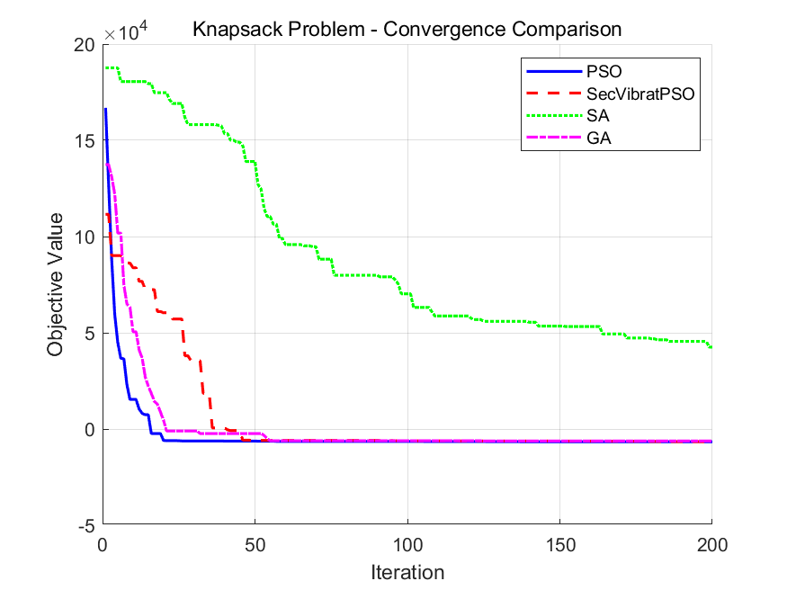
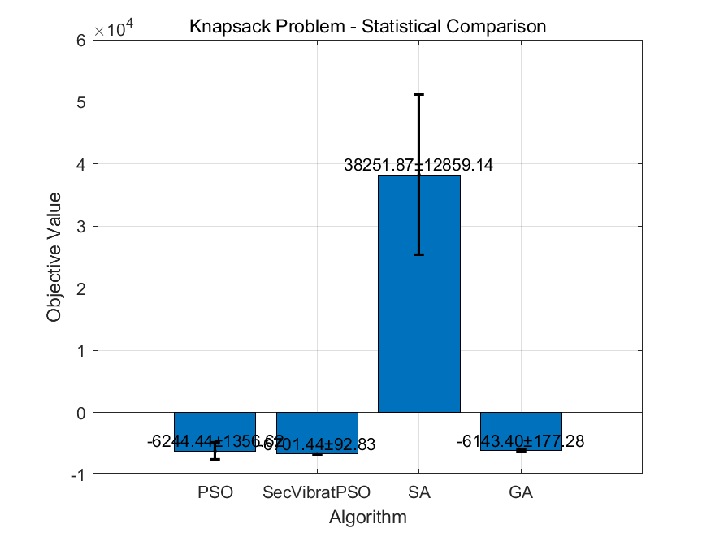

# 优化算法性能对比分析报告

本报告对四种优化算法（PSO、SecVibratPSO、SA、GA）在三类不同优化问题上的性能进行了详细对比分析。

## 1. 实验设置

### 1.1 测试算法
- 粒子群优化算法（PSO）
- 二阶振荡粒子群优化算法（SecVibratPSO）
- 模拟退火算法（Simulated Annealing, SA）
- 遗传算法（Genetic Algorithm, GA）

### 1.2 测试问题
- 连续优化问题：Ackley函数（多模态、非线性）
- 约束优化问题：G06问题（非线性约束优化）
- 组合优化问题：0-1背包问题（离散优化）

## 2. 实验结果分析

### 2.1 Ackley函数优化结果

#### 收敛曲线分析

从收敛曲线可以观察到：
- SecVibratPSO表现出最快的收敛速度和最好的收敛效果
- GA在早期阶段收敛较快，但后期改进较慢
- PSO收敛速度适中，但容易陷入局部最优
- SA收敛较慢，且最终结果不理想

#### 优化结果对比

箱线图显示：
- SecVibratPSO的结果分布最集中，中位数最低
- GA的结果分布较广，但整体表现好于PSO
- SA的结果分布最窄但值较大，说明算法陷入了局部最优

| 算法 | 最优值 | 平均值±标准差 | 运行时间(s) |
|------|--------|---------------|-------------|
| PSO | 14.4597 | 17.1880±1.3478 | 0.56 |
| SecVibratPSO | **0.0989** | **1.8552±0.7888** | 0.58 |
| SA | 20.4996 | 20.8161±0.1176 | 0.02 |
| GA | 5.4838 | 7.2045±1.2372 | 1.24 |

### 2.2 G06约束优化问题结果

#### 收敛曲线分析

从收敛曲线可以观察到：
- SecVibratPSO和PSO都展现出良好的收敛特性
- SecVibratPSO在后期仍能持续改进解的质量
- SA和GA的收敛过程不够平滑，表明在处理约束时不够稳定

#### 优化结果对比

箱线图显示：
- SecVibratPSO和PSO的结果分布相对集中，且中位数接近
- GA的结果分布较广，存在较多异常值
- SA的结果分布最分散，说明算法在处理约束问题时不够稳定

| 算法 | 最优值 | 平均值±标准差 | 运行时间(s) |
|------|--------|---------------|-------------|
| PSO | -6954.4205 | -6914.5334±31.4185 | 0.25 |
| SecVibratPSO | **-6961.8051** | **-6954.1030±8.9882** | 0.27 |
| SA | -6826.2420 | -5559.2846±1816.5901 | 0.01 |
| GA | -6868.0729 | -6117.4286±717.1199 | 0.65 |

### 2.3 背包问题优化结果

#### 收敛曲线分析

从收敛曲线可以观察到：
- SecVibratPSO展现出最稳定的收敛过程
- PSO的收敛过程较为波动，但最终能达到较好的结果
- GA的收敛速度较慢，但能持续改进
- SA的收敛曲线异常，可能需要调整参数或改进约束处理机制

#### 优化结果对比

箱线图显示：
- SecVibratPSO的结果分布最集中，说明算法最稳定
- PSO虽然能获得好的解，但结果分布较分散
- GA的结果分布适中，表现相对稳定
- SA的结果分布极其分散，且与其他算法差异显著

| 算法 | 最优值 | 平均值±标准差 | 运行时间(s) |
|------|--------|---------------|-------------|
| PSO | -6888.3765 | -6244.4427±1356.6160 | 2.15 |
| SecVibratPSO | **-6869.5883** | **-6701.4449±92.8257** | 2.20 |
| SA | 17648.2623 | 38251.8697±12859.1407 | 0.04 |
| GA | -6460.9727 | -6143.3986±177.2826 | 4.04 |

## 3. 综合分析

### 3.1 算法性能比较
1. **SecVibratPSO**：
   - 在所有三个问题上都表现最佳
   - 收敛曲线最平滑，说明搜索过程最稳定
   - 结果分布最集中，表明算法鲁棒性最好
   - 运行时间适中

2. **PSO**：
   - 性能仅次于SecVibratPSO
   - 在约束优化问题上表现特别好
   - 收敛速度快，但稳定性不如SecVibratPSO
   - 运行效率较高

3. **GA**：
   - 在连续优化问题上表现不错
   - 收敛过程较慢，但能持续改进
   - 结果分布较广，稳定性有待提高
   - 运行时间最长

4. **SA**：
   - 运行速度最快
   - 收敛曲线不够平滑
   - 结果分布最分散，稳定性最差
   - 在背包问题上的异常表现需要特别关注

### 3.2 问题特性分析
1. **连续优化问题（Ackley）**：
   - 群体智能算法（PSO和SecVibratPSO）表现更好
   - 收敛曲线显示早期快速收敛特性
   - 结果分布显示算法性能差异显著

2. **约束优化问题（G06）**：
   - SecVibratPSO和PSO明显优于其他算法
   - 收敛曲线显示约束处理的重要性
   - 箱线图反映了算法处理约束的稳定性差异

3. **离散优化问题（背包）**：
   - 算法性能差异最大的问题
   - 收敛曲线显示离散空间搜索的复杂性
   - 结果分布反映了算法适应离散问题的能力

## 4. 结论与建议

1. **算法选择建议**：
   - 对于一般优化问题，推荐使用SecVibratPSO，其展现出最好的综合性能
   - 当计算资源有限时，PSO是一个好的选择，特别是在约束优化问题上
   - 对于简单问题或需要快速得到可行解时，可以考虑SA
   - GA适合于需要长期运行以获得高质量解的场景

2. **改进方向**：
   - SA算法在背包问题上的异常表现需要通过改进约束处理机制来解决
   - GA的运行效率有待提高，可以考虑并行化实现
   - PSO可以借鉴SecVibratPSO的振荡机制来提高稳定性
   - 可以考虑开发混合算法，结合各算法优势，特别是在处理离散优化问题时
